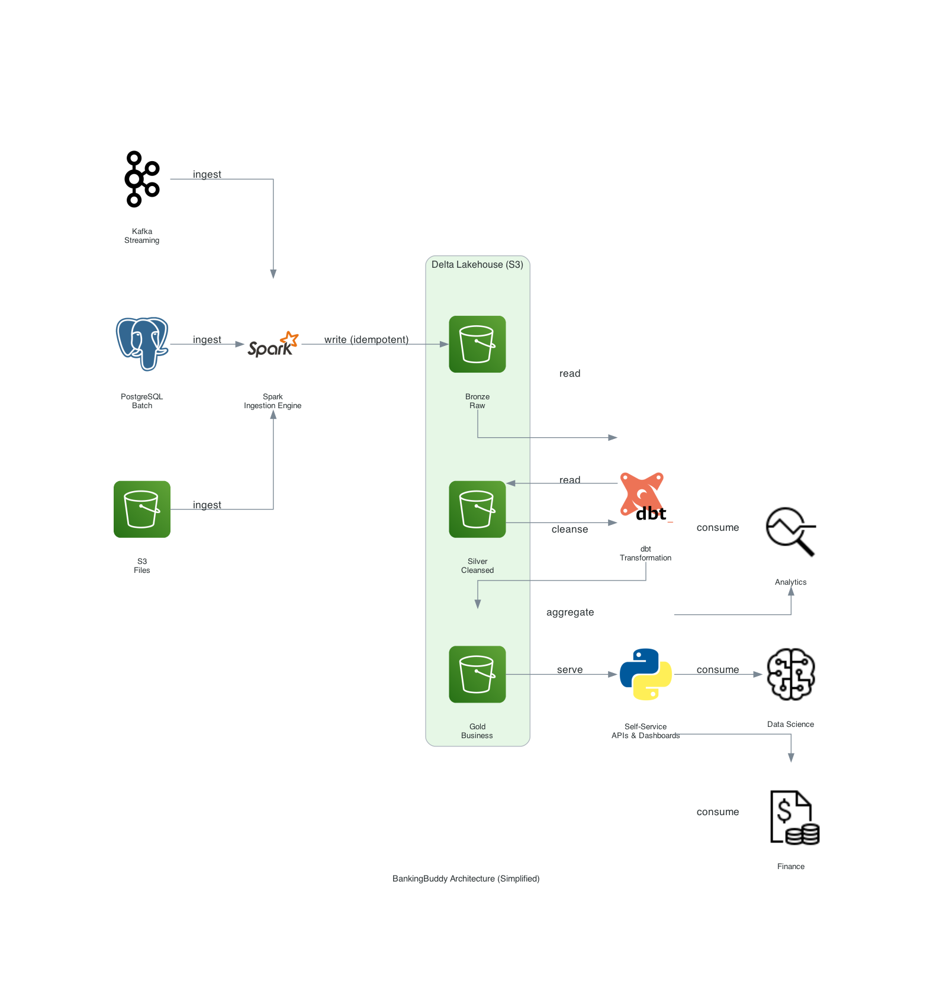
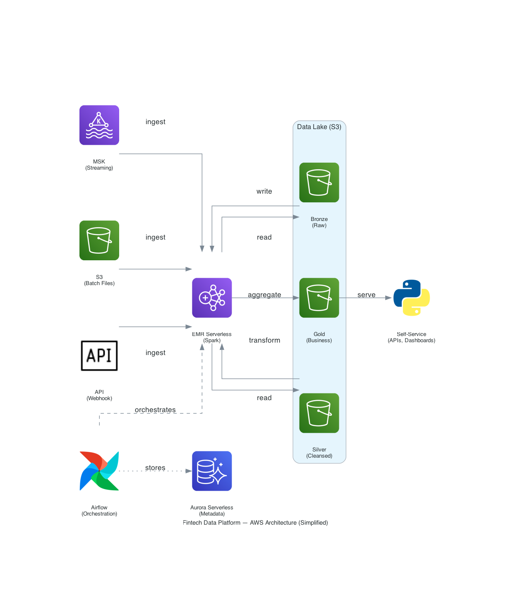

# fintech-data-platform

A complete FinTech data platform designed to cover batch and streaming ETL, self service analytics, sensitive data and audit compliance and more for use cases such as lending, transactions and fraud detection.

## Project Rationale

Modern data platforms aren't built overnight and are not just about transforming data and loading it into a warehouse. Many factors must be taken into consideration: ensuring the data is accurate and modeled in a sustainable way, that the pipelines can be rerun to backfill historical data, the platform can scale to accomodate an order of magnitude of increased growth (i.e. 10x), and much more.

In this project I will be implementing a full fledged end to end data "fintech" (Financial Technology) data platform, supporting stakeholders such as Data Analysts, Data Scientists, Product Engineers and Compliance Analysts.

**NOTE: All business scenarios and data in this project are synthetic and are solely for the purpose of experimenting and learning.**

## Project Scope and Trajectory

Similar to how real world data systems evolve over time, this project will be built gradually with each stage building on the work of the previous stages.

Because this project uses synthetic data, there will need to be tools built out to help generate the data required for this project. There's no data platforms without data!

## High Level Architecture

The platform follows a [medallion architecture](https://www.databricks.com/blog/what-is-medallion-architecture) (Bronze/Silver/Gold) on Delta Lake, processing data via both batch and streaming pipelines:

1. Extensible configuration based data ingestion layer
2. Staging data layer for raw, immutable data from source systems
3. Intermediate data layer for cleansed, deduplicated data
4. Business facing data layer with highly optimized tables for analysis and model training
5. Self service tooling layer for dashboarding, feature backfills and more
6. Observability stack encompassing metrics tracking, data lineage, oncall alerting, notifications and compliance logging

A more detailed design doc can be found [here](docs/design_doc.md).

## Deployment Options

This platform supports two deployment modes — **Local** (Docker Compose, for development) and **AWS** (managed services, for production), with **GCP** planned. Files are organized under `deployment/` by cloud provider.

### 1. Local Development (Docker Compose)

**NOTE: This setup is running into issues with the Airflow webserver stuck in a constant restart loop due to a conflict with the Airflow database migration. [Issue tracked here](https://github.com/njfritter/fintech-data-platform/issues/5).**



> Simplified view. See the [detailed architecture diagram](./docs/diagrams/local/bankingbuddy_architecture.png) and the [design doc](./docs/design_doc.md) for the full breakdown.

**Requirements:**
- 4 CPU minimum (8 CPU or more for more cushion)
- 16GB RAM minimum (24GB RAM or more for more cushion)

If your local machine does not meet these requirements, proceed to the [AWS Deployment](#2-aws-deployment-production) section below.

```bash
# Install brew and related packages
sh scripts/local/mac_quickstart.sh

# Start Colima (used for more memory efficient VM management)
colima start --memory 16 --cpu 4

# Create necessary directories
mkdir -p data logs

# Initialize Databases
sudo docker compose up airflow-init -d
sudo docker compose up metabase-init -d

# Start up rest of the stack
docker compose up -d

# Verify the stack
docker exec -it fintech-data-platform-airflow-scheduler-1 airflow version
docker exec -it fintech-data-platform-spark-worker-1 spark-submit --version
docker exec -it fintech-data-platform-spark-master-1 cat /opt/spark/conf/spark-env.sh
```

### 2. AWS Deployment (Production)



> Simplified view. See the [detailed architecture diagram](./docs/diagrams/aws/aws_architecture.png) for the full component breakdown.

> **Note:** This deployment provisions managed AWS services (MSK, EMR Serverless, Aurora, S3) for a production-grade stack, orchestrated via Terraform.

#### Prerequisites

- [Terraform](https://developer.hashicorp.com/terraform/downloads) >= 1.5.0
- AWS CLI configured with appropriate credentials
- An S3 bucket for Terraform state (set up once)

#### Directory Structure

All AWS deployment files live under `deployment/aws/`:

```
deployment/aws/
├── terraform/
│   ├── main.tf                   # Main infrastructure definition
│   ├── variables.tf               # Input variables
│   ├── outputs.tf                 # Output values
│   ├── versions.tf                # Provider and backend config
│   ├── terraform.tfvars.example
│   ├── user_data.sh               # EC2 startup script
│   └── lambda/                    # Lambda for cost optimization
│       ├── start_instances.py
│       └── stop_instances.py
├── iam/
│   ├── fintech-data-platform-terraform-policy-1.json
│   ├── fintech-data-platform-terraform-policy-2.json
│   └── s3-bucket-policy.txt
└── scripts/
    └── aws_user_data_script.sh    # Quick EC2 Docker Compose setup
```

#### Deploying via Terraform (Managed Services)

```bash
# 1. Apply IAM permissions (see deployment/aws/iam/)
# 2. Configure AWS credentials
aws configure

# 3. Set up S3 backend (one-time, then update backend config in versions.tf)
aws s3 mb s3://your-terraform-state-bucket --region us-east-1

# 4. Deploy infrastructure
cd deployment/aws/terraform
cp terraform.tfvars.example terraform.tfvars   # Edit with your values
terraform init
terraform plan
terraform apply -auto-approve

# 5. Get outputs
terraform output
```

#### Quick EC2 Deployment (Docker Compose on AWS)

For a single-VM deployment running the Docker Compose stack on AWS, see [`deployment/aws/scripts/aws_user_data_script.sh`](./deployment/aws/scripts/aws_user_data_script.sh).

### 3. GCP Deployment (Planned)

> **Coming soon.** A GCP deployment path is planned and will live under `deployment/gcp/`. A startup script for a single Compute VM is already available at [`deployment/gcp/scripts/gcp_startup_script.sh`](./deployment/gcp/scripts/gcp_startup_script.sh) — a full Terraform-based deployment (using Dataproc, Pub/Sub, Cloud Storage, Cloud SQL) will follow.

## Generating User Data

Use `scripts/generate_mock_data.py` to generate synthetic fintech data:

```bash
# Generate data for 10,000 users (default)
pipenv run python scripts/generate_mock_data.py

# Generate data for 100,000 users
pipenv run python scripts/generate_mock_data.py --users 100000

# Generate streaming events (default: 1,000)
pipenv run python scripts/generate_mock_data.py --stream

# Generate 100,000 streaming events
pipenv run python scripts/generate_mock_data.py --stream --stream-count 100000
```

## Generating Architecture Diagrams

Architecture diagrams are generated using the `diagrams` Python library:

```bash
# Local architecture
pipenv run python docs/diagrams/local/local_architecture_diagram.py

# AWS architecture
pipenv run python docs/diagrams/aws/aws_architecture.py
```

## Documentation

| Document | Description |
|----------|-------------|
| [Design Doc](docs/design_doc.md) | Detailed architecture, technology choices, tradeoffs |
| [PRD](docs/prd.md) | Product requirements and business context |
| [Data Dictionary](docs/data_dictionary.md) | Schema definitions, PII classifications, ownership |
| [On-Call Runbook](docs/oncall_runbook.md) | Incident response procedures |
| [Production Readiness Checklist](docs/production_readiness_checklist.md) | Go-live requirements |
